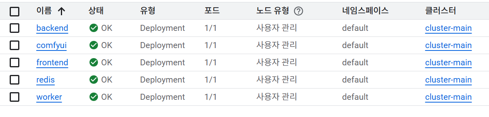

# AI 맞춤형 광고 제작 서비스

생성형 AI를 활용하여 소상공인이 디자인 역량 없이도 광고 이미지와 카피를 자동 제작하는 서비스입니다.

업종과 스타일만 선택하면 ComfyUI가 SDXL(DreamShaper XL) + IP-Adapter로 배경 이미지를 생성하고, GPT-5-mini가 한국어 광고 문구를 작성하며, 제품 사진을 업로드하면 배경 제거 후 자동 합성합니다.

---

## 주요 기능

| 기능 | 설명 |
|------|------|
| 업종 / 카테고리 선택 | 음식, IT서비스, 패션, 뷰티 등 — 업종별 광고 전략 프롬프트 자동 적용 |
| 테마 / 스타일 선택 | 카툰, 실사, 미니멀 등 스타일 선택 |
| 광고 이미지 생성 | ComfyUI → SDXL(DreamShaper XL) + IP-Adapter Advanced (T4 GPU) |
| 제품 이미지 합성 | rembg 배경 제거 + 소프트 엣지 + 드롭 섀도우 + 위치 5종 선택 |
| 광고 문구 생성 | GPT-5-mini 기반 한국어 카피 자동 생성 |
| 카피 오버레이 | NanumPen 손글씨 폰트 + 8방향 아웃라인 + 줄별 기울기 효과 |
| 멀티턴 피드백 | 대화 컨텍스트 유지하며 수정 요청 가능 |
| 결과 다운로드 | 광고 이미지 + 문구 개별 다운로드 |

---

## 기술 스택

| 영역 | 기술 |
|------|------|
| 프론트엔드 | React 18 + Vite + Tailwind CSS |
| 백엔드 API | FastAPI + Celery (비동기 작업 큐) |
| 메시지 브로커 | Redis |
| 이미지 생성 API | ComfyUI (workflow JSON 기반, port 8188) |
| 이미지 생성 모델 | SDXL (Lykon/DreamShaper XL, fp16) + IP-Adapter Advanced (h94/IP-Adapter ViT-H) |
| 배경 제거 | rembg (U2Net, ONNX Runtime) |
| 텍스트 오버레이 | Pillow + NanumPen/NanumGothic |
| LLM | OpenAI GPT-5-mini (프롬프트 빌드 + 카피 작성) |
| 컨테이너 | Docker (ComfyUI GPU pod + CPU backend/worker pod) |
| 오케스트레이션 | Kubernetes (GKE, T4 Spot GPU 노드) |

---

## 아키텍처

```
[사용자 브라우저]
      │
      ▼
[React 프론트엔드]  nginx · LoadBalancer
      │  POST /api/generate  (multipart/form-data)
      ▼
[FastAPI 백엔드]    비동기 작업 발행 → job_id 즉시 반환
      │
      ▼
[Redis]            브로커 + 결과 저장 (TTL 1h)
      │
      ▼
[Celery Worker]    CPU 노드
      ├── build_sd_prompt()   → GPT-5-mini: SDXL 영문 프롬프트 생성
      ├── write_copy()        → GPT-5-mini: 멀티턴 한국어 카피 생성
      ├── POST /prompt        → ComfyUI: SDXL + IP-Adapter 이미지 생성 요청
      │       └── rembg 배경제거 + 그림자 + 위치 합성 (Worker에서 처리)
      └── overlay_copy_on_image()  → 폰트 + 아웃라인 + 기울기 오버레이

[ComfyUI Service]  GPU 노드 (T4 Spot) · ClusterIP · port 8188
      └── SDXL(DreamShaper XL) + IP-Adapter Advanced → 1024×1024 PNG 생성

[프론트엔드]  GET /api/status/{job_id} 2초 폴링 → 완료 시 base64 이미지 수신
```

### VRAM 구성 (T4 14.56 GB · ComfyUI 관리)

ComfyUI model_management.py가 자동으로 VRAM 관리합니다.

| 컴포넌트 | 크기 |
|---------|------|
| SDXL UNet (fp16) | ~5.0 GB |
| CLIP-L + OpenCLIP-G 텍스트 인코더 | ~1.4 GB |
| VAE (fp16) | ~0.3 GB |
| IP-Adapter ViT-H 가중치 | ~1.0 GB |
| ComfyUI 런타임 | ~0.5 GB |
| 합계 | ~8.2 GB (여유 ~6 GB) |
| rembg ONNX | CPU RAM (Worker pod) |

---

## 디렉토리 구조

```
project3/
├── backend/
│   ├── main.py              # FastAPI 엔드포인트 (/generate, /status)
│   ├── tasks.py             # Celery 태스크 (generate_ad)
│   ├── comfyui_client.py    # ComfyUI HTTP 클라이언트 (워크플로우 구성 + 폴링)
│   ├── pipeline_sdxl.py     # SDXL 파이프라인 (ComfyUI 전환 후 로컬 디버깅용)
│   ├── categories.py        # 업종별 광고 전략 프롬프트
│   ├── themes.py            # 테마별 스타일 프롬프트
│   ├── celery_app.py        # Celery 앱 설정
│   └── requirements.txt
├── frontend/
│   ├── src/
│   │   ├── App.jsx
│   │   └── components/      # Sidebar, SettingsPanel, Workspace 등
│   ├── nginx.conf
│   └── package.json
├── scripts/
│   ├── download_models.py   # ComfyUI 최초 기동 시 모델 다운로드 (CivitAI + HuggingFace)
│   └── entrypoint.sh        # ComfyUI 컨테이너 진입점
├── k8s/
│   ├── backend.yaml         # FastAPI Deployment + Service
│   ├── worker.yaml          # Celery Worker Deployment (CPU pod)
│   ├── frontend.yaml        # React Deployment + LoadBalancer
│   ├── redis.yaml           # Redis Deployment + Service
│   ├── comfyui.yaml         # ComfyUI Deployment (GPU) + ClusterIP Service
│   └── comfyui-models-pvc.yaml  # 모델 저장용 PVC (20Gi)
├── workflow_basic.json      # ComfyUI 기본 워크플로우 (GUI 테스트용)
├── workflow_ipadapter.json  # ComfyUI IP-Adapter 워크플로우 (GUI 테스트용)
├── Dockerfile.backend       # python:3.11-slim (GPU 없음)
├── Dockerfile.comfyui       # pytorch:2.5.1-cuda12.4 + ComfyUI + IPAdapter_plus
├── Dockerfile.frontend
└── docs/
    ├── arch.md              # 시스템 아키텍처 다이어그램
    ├── decisions.md         # 모델/기술 선택 의사결정 로그
    ├── guide.md             # 상세 가이드
    └── plan.md              # 프로젝트 기획
```

---

## GKE 배포

### 사전 요구사항

- GKE 클러스터 (T4 GPU 노드풀 포함)
- Artifact Registry 저장소
- CivitAI API 키 (DreamShaper XL 다운로드용)

### Secret 생성

```bash
kubectl create secret generic ad-secrets \
  --from-literal=OPENAI_API_KEY=sk-... \
  --from-literal=HF_TOKEN=hf_... \
  --from-literal=CIVITAI_API_KEY=...
```

### 이미지 빌드 & 푸시

```bash
REGISTRY=asia-east1-docker.pkg.dev/<PROJECT>/ad-gen-project

docker build -f Dockerfile.comfyui -t $REGISTRY/comfyui:latest .
docker push $REGISTRY/comfyui:latest

docker build -f Dockerfile.backend -t $REGISTRY/backend:latest .
docker push $REGISTRY/backend:latest

docker build -f Dockerfile.frontend -t $REGISTRY/frontend:latest .
docker push $REGISTRY/frontend:latest
```

### 배포

```bash
# PVC + ComfyUI (최초 기동 시 모델 자동 다운로드 ~10분 소요)
kubectl apply -f k8s/comfyui-models-pvc.yaml
kubectl apply -f k8s/comfyui.yaml

# 나머지
kubectl apply -f k8s/backend.yaml
kubectl apply -f k8s/worker.yaml
kubectl apply -f k8s/frontend.yaml
kubectl apply -f k8s/redis.yaml
```

### 배포된 pod 예시


### ComfyUI GUI 디버깅

```bash
kubectl port-forward deployment/comfyui 8188:8188
# → localhost:8188 에서 ComfyUI GUI 접근
# workflow_basic.json 또는 workflow_ipadapter.json 을 Load하여 테스트
```

---

## 모델 라이선스

| 모델 / 패키지 | 라이선스 |
|-------------|---------|
| Lykon/DreamShaper XL (SDXL) | Apache 2.0 계열 |
| h94/IP-Adapter (SDXL ViT-H) | Apache 2.0 |
| ComfyUI | GPL-3.0 (서버사이드) |
| rembg (U2Net) | MIT |
| NanumGothic / NanumPen | OFL |
| GPT-5-mini (OpenAI API) | 상업 이용 허용 |
